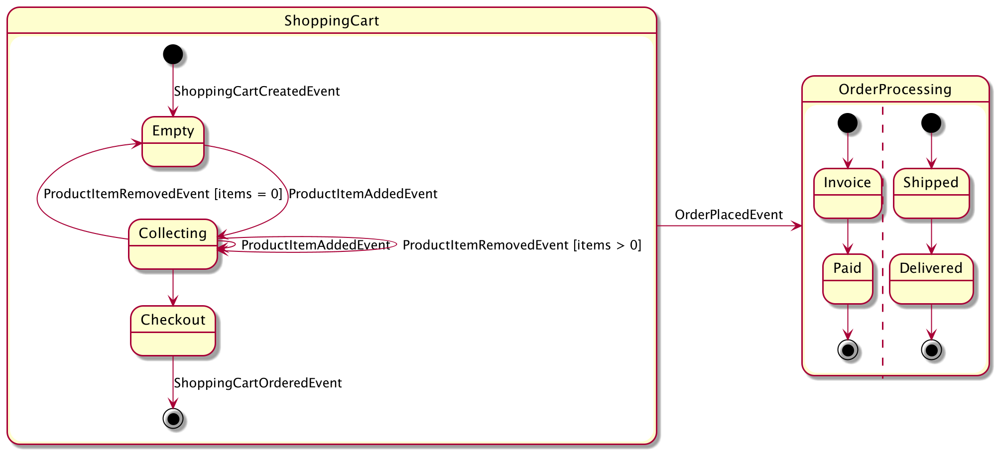

# Axon State Machines

Sample project demonstrating how to build and test state machines using
[Axon Framework](https://github.com/AxonFramework), see the accompanying [video tutorial](http://www.youtube.com/watch?v=pbVqNINp-ec "Axon Demystified: Building State Machines"):
[](http://www.youtube.com/watch?v=pbVqNINp-ec "Axon Demystified: Building State Machines")

This project contains a [sample shopping domain](src/main/kotlin/de/digitalfrontiers/axon/statemachine/domain), 
based on the following state diagram:


## Build & Run
The project can be built and started using:
```shell script
./gradlew clean bootBuildImage
docker-compose up
```

You will see random shopping events, once the application has been
successfully started.

The database can be reset using, if needed, using:
```shell script
docker-compose down
```
